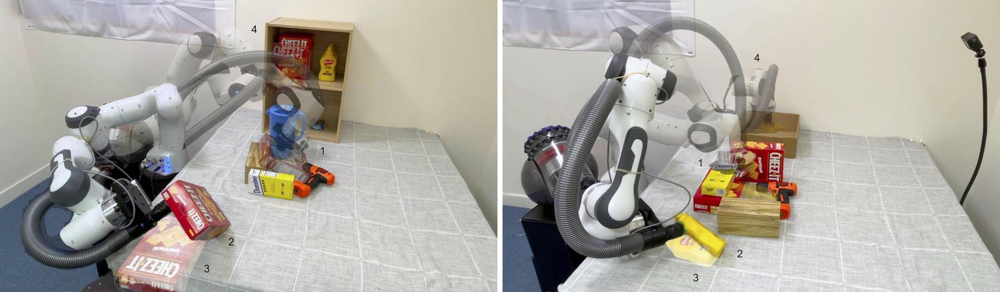
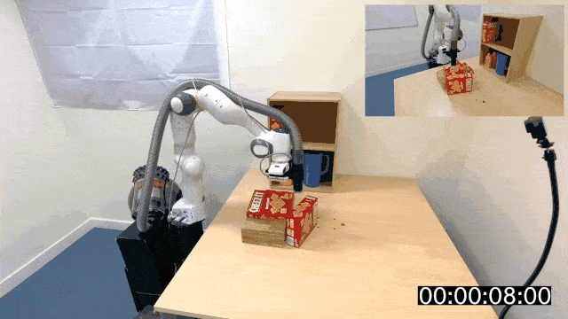
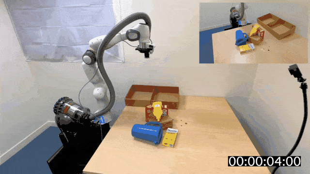
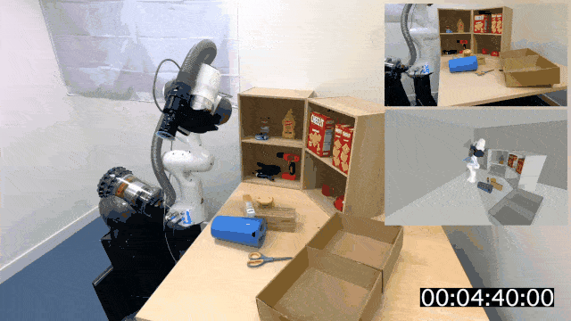
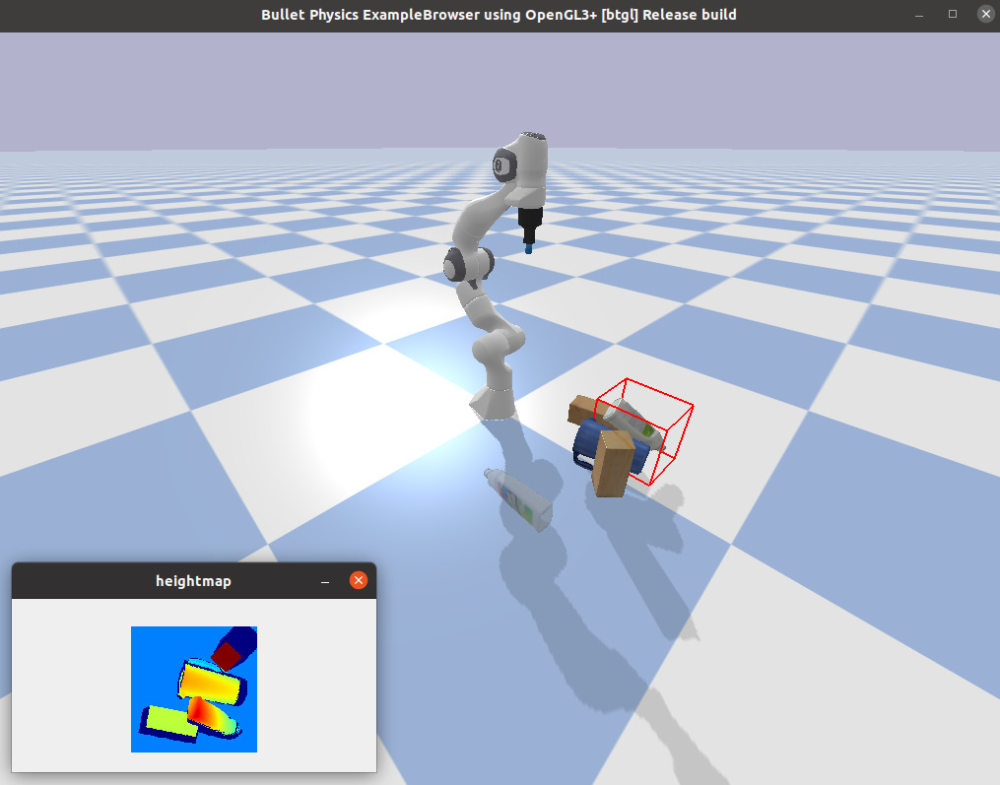
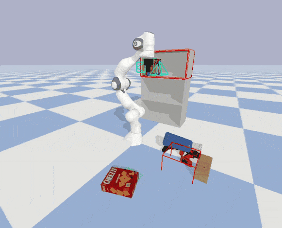
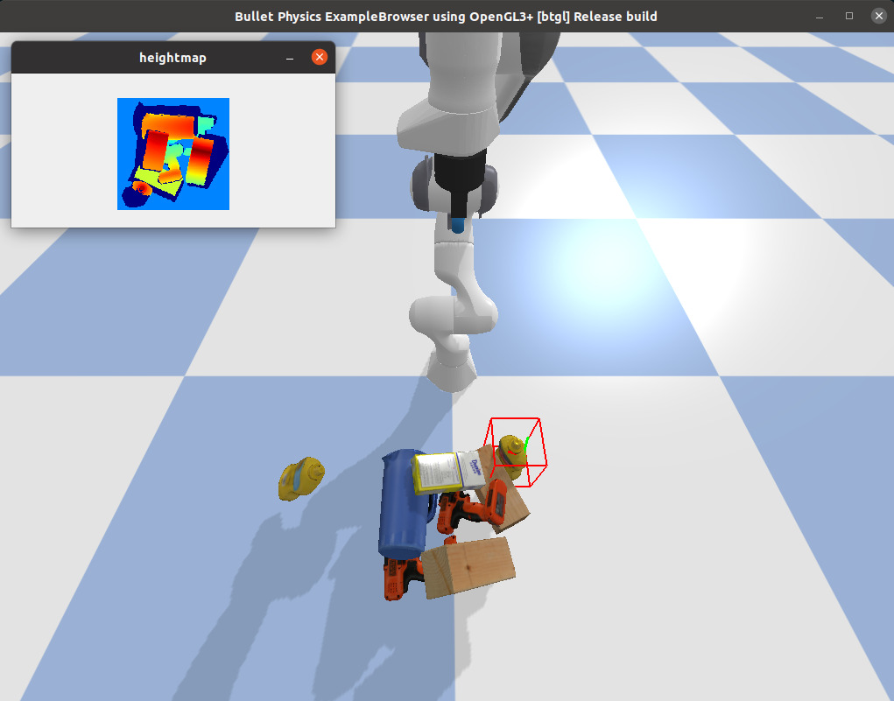
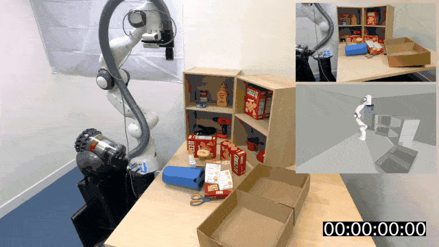
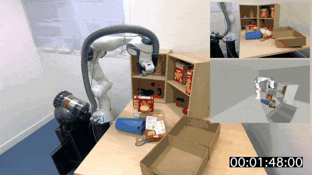
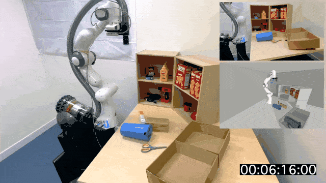

<h1 align="center">ReorientBot</h1>
<h3 align="center">Learning Object Reorientation for Specific-Posed Placement</h3>

<p align="center">
  <a href="https://wkentaro.com">Kentaro Wada</a>,
  <a href="https://stepjam.github.io">Stephen James</a>,
  <a href="https://www.doc.ic.ac.uk/~ajd/">Andrew J. Davison</a>
  <br/>
  <a href="https://www.imperial.ac.uk/dyson-robotics-lab/">Dyson Robotics Laboratory</a>,
  <a href="https://www.imperial.ac.uk/">Imperial College London</a>
  <br/>
  IEEE International Conference on Robotics and Automation (ICRA), 2022
</p>

<p align="center">
  <a href="#installation"><b>Installation</b></a> |
  <a href="#usage"><b>Usage</b></a> |
  <a href="https://arxiv.org/abs/TODO"><b>Paper</b></a> |
  <a href="https://youtu.be/ahWN84sWWJU"><b>Video</b></a> |
  <a href="https://reorientbot.wkentaro.com"><b>Website</b></a>
</p>

<div align="center">
  
</div>

---

<div align="center">
  
  
  
</div>

## Installation

### Python project only

```bash
make install

source .anaconda3/bin/activate
./checks/check_motion_planning.py
```

### ROS project

- `robot-agent`: A computer for visual processing.
- `robot-node`: A computer with a real-time OS for a Panda robot.

#### @robot-agent

```bash
make install
source .anaconda3/bin/activate

cd ros/
make install
source devel/setup.sh
```

#### @robot-node

```
cd ros/
source /opt/ros/noetic/setup.sh

catkin build morefusion_panda
rosrun morefusion_panda create_udev_rules.sh

catkin build reorientbot_ros
```

## Usage

### Training & inference

#### Reorient pose selection

```bash
cd examples/reorientation/

./download_piles.py

# # train from scratch
# for seed in $(seq 0 4999); do
#   ./pickable_create_dataset.py --seed $seed
# done
# ./pickable_view_dataset.py
# ./pickable_train.py --name franka_panda-panda_suction

# NOTE: replace model path to use your own model
./pickable_eval.py --seed 0
```

<div>
  
  
  <p><i>Figure 1. Reorient pose selection's dataset (left) and inference (right)</i></p>
</div>

#### Reorient motion selection

```bash
# # train from scratch
# for seed in $(seq 0 4999); do
#   ./reorientable_create_dataset.py --seed $seed
# done
# ./reorientable_view_dataset.py
# ./reorientable_train.py --name franka_panda-panda_suction

# NOTE: replace model path to use your own model
./reorient_dynamic.py --seed 0 --face front
```

<div>
  
  
  <p><i>Figure 2. Reorient motion selection's dataset (left) and inference (right)</i></p>
</div>

### Real-world demonstration

```bash
robot-node  $ roslaunch reorientbot_ros panda_control.launch

robot-agent $ roslaunch reorientbot_ros setup.launch
robot-agent $ rosrun reorientbot_ros reorientbot_task_interface.py
>>> # self.run_singleview()
>>> self.run_multiview()
```

<div>
  
  
  
  <p><i>Figure 3. Robotic rearrangement while picking, reorienting and placing objects.</i></p>
</div>

## Citation

```
@inproceedings{Wada:etal:ICRA2022b,
  title={{ReorientBot}: Learning Object Reorientation for Specific-Posed Placement},
  author={Kentaro Wada and Stephen James and Andrew J. Davison},
  booktitle={IEEE International Conference on Robotics and Automation (ICRA)},
  year={2022},
}
```
